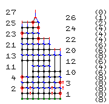

# edge

```
- 5 co 8 turn
1: pu 1 k 2 yo 1 k2tog 1 k 1 yo 2 k 2 - 3 turn
2: - 3 pu 1 k 2 p 1 k 3 yo 1 k2tog 1 k 1 turn
3: pu 1 k 2 yo 1 k2tog 1 k 5 - 3 turn
4: - 3 pu 1 k 6 yo 1 k2tog 1 k 1 turn
5: pu 1 k 2 yo 1 k2tog 1 k 1 yo 2 k2tog 1 yo 2 k 2 turn
6: pu 1 k 2 p 1 k 2 p 1 k 3 yo 1 k2tog 1 k 1 turn
7: pu 1 k 2 yo 1 k2tog 1 k 8 turn
8: bo 5 pu 1 k 4 yo 1 k2tog 1 k 1 turn

second rep:
pu 1 k 2 yo 1 k2tog 1 k 1 yo 2 k 2 - 3 turn
- 3 pu 1 k 2 p 1 k 3 yo 1 k2tog 1 k 1 turn
pu 1 k 2 yo 1 k2tog 1 k 5 - 3 turn
- 3 pu 1 k 6 yo 1 k2tog 1 k 1 turn
pu 1 k 2 yo 1 k2tog 1 k 1 yo 2 k2tog 1 yo 2 k 2 turn
pu 1 k 2 p 1 k 2 p 1 k 3 yo 1 k2tog 1 k 1 turn
pu 1 k 2 yo 1 k2tog 1 k 8 turn
bo 5 pu 1 k 4 yo 1 k2tog 1 k 1 turn

third rep:
pu 1 k 2 yo 1 k2tog 1 k 1 yo 2 k 2 - 3 turn
- 3 pu 1 k 2 p 1 k 3 yo 1 k2tog 1 k 1 turn
pu 1 k 2 yo 1 k2tog 1 k 5 - 3 turn
- 3 pu 1 k 6 yo 1 k2tog 1 k 1 turn
pu 1 k 2 yo 1 k2tog 1 k 1 yo 2 k2tog 1 yo 2 k 2 turn
pu 1 k 2 p 1 k 2 p 1 k 3 yo 1 k2tog 1 k 1 turn
pu 1 k 2 yo 1 k2tog 1 k 8 turn
bo 5 pu 1 k 4 yo 1 k2tog 1 k 1 turn

bo 8
```


# fan\_and\_split

```
co 10 turn
k 10 turn
p 1 * yo 1 p 1 * 9 turn
k 19 turn
p 19 turn
k 4 bo 11 k 4 turn
p 4 - 11 p 4 turn
k 1 k2tog 1 k 1 - 11 k 1 SSK 1 k 1 turn
p 1 p2tog 1 - 11 SSP 1 p 1 turn
k2tog 1 - 11 SSK 1 turn
bo 1 - 11 bo 1
```


# incs

```
co 8 turn
1: k 8 turn
2: p 8 turn
3: pu 1 k 1 * k 1 M 1 k 1 * 2 k 2 turn
4: p 10 turn
5: pu 1 * k 1 k2tog 1 k 1 * 2 k 1 turn
6: p 8 !warn turn

7: k 3 M 1 k 2 M 1 k 3 return
8: k 3 M 1 k 4 M 1 k 3 return
9: k 2 CDD 1 k 2 CDD 1 k 2 return

bo 9
```


# lace

```
co 14 turn
k 14 turn
p 14 turn
k 1 * yo 1 k2tog 1 k 1 SSK 1 yo 1 k 1 * 2 k 1 turn
p 14 turn
k 1 * SSK 1 yo 1 k 1 yo 1 k2tog 1 k 1 * 2 k 1 turn
p 14 turn
k 14 turn
bo 14
```


# markers

```
co 8 turn
pu 1 k 1 !B k 4 !A k 2 turn
pu 1 p 1 !b p 4 !A p 2 !pattern-change turn
!pattern-change pu 1 * p 1 k 1 * 3 p 1 turn
pu 1 * p 1 k 1 * 3 p 1 turn
```



# tunisianx

```
co 10 turn
| 10 return
| 1 Xss 4 || 1 return
| 1 Tss 1 Xss 3 Tss 1 || 1 return
| 1 Xss 4 || 1 return
| 1 Tss 1 Xss 3 Tss 1 || 1 return
| 1 Xss 4 || 1
| 1 Tss 1 Xss 3 Tss 1 || 1
| 1 Xss 4 || 1
| 1 Tss 1 Xss 3 Tss 1 || 1
| 1 Tss 1 || 1  sk 4      | 1  Tss 1 || 1
| 1 Tss 1 || 1  - 4      | 1  Tss 1 || 1
bo 3 - 4 bo 3
```


