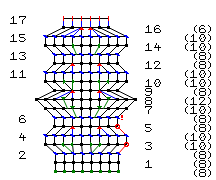
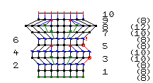
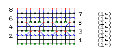
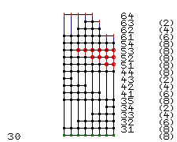
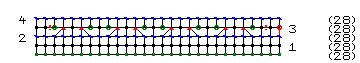
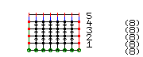
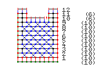

# ball

```
ch 1 turn
1: 6s 1 join
2: 2s 6 join
3: * 2s 1  s 1 * 6 join
4: * 2s 1  s 2 * 6 join
5: * 2s 1  s 3 * 6 join
6: * 2s 1  s 4 * 6 join

7: s 36 join
8: s 36 join
9: s 36 join
10: s 36 join

11: * s2tog 1 s 4 * 6 join
12: * s2tog 1 s 3 * 6 join
13: * s2tog 1 s 2 * 6 join
14: * s2tog 1 s 1 * 6 join
15: s2tog  6 join
16: s2tog 3 join

16: bo 3
```


# edge

```
co 8 turn
1: pu 1 k 2 yo 1 k2tog 1 k 1 yo 2 k 2 turn
2: pu 1 k 2 p 1 k 3 yo 1 k2tog 1 k 1 turn
3: pu 1 k 2 yo 1 k2tog 1 k 5 turn
4: pu 1 k 6 yo 1 k2tog 1 k 1 turn
5: pu 1 k 2 yo 1 k2tog 1 k 1 yo 2 k2tog 1 yo 2 k 2 turn
6: pu 1 k 2 p 1 k 2 p 1 k 3 yo 1 k2tog 1 k 1 turn
7: pu 1 k 2 yo 1 k2tog 1 k 8 turn
8: bo 5 pu 1 k 4 yo 1 k2tog 1 k 1 turn

second rep:
1: pu 1 k 2 yo 1 k2tog 1 k 1 yo 2 k 2 turn
2: pu 1 k 2 p 1 k 3 yo 1 k2tog 1 k 1 turn
3: pu 1 k 2 yo 1 k2tog 1 k 5 turn
4: pu 1 k 6 yo 1 k2tog 1 k 1 turn
5: pu 1 k 2 yo 1 k2tog 1 k 1 yo 2 k2tog 1 yo 2 k 2 turn
6: pu 1 k 2 p 1 k 2 p 1 k 3 yo 1 k2tog 1 k 1 turn
7: pu 1 k 2 yo 1 k2tog 1 k 8 turn
8: bo 5 pu 1 k 4 yo 1 k2tog 1 k 1 turn

third rep:
1: pu 1 k 2 yo 1 k2tog 1 k 1 yo 2 k 2 turn
2: pu 1 k 2 p 1 k 3 yo 1 k2tog 1 k 1 turn
3: pu 1 k 2 yo 1 k2tog 1 k 5 turn
4: pu 1 k 6 yo 1 k2tog 1 k 1 turn
5: pu 1 k 2 yo 1 k2tog 1 k 1 yo 2 k2tog 1 yo 2 k 2 turn
6: pu 1 k 2 p 1 k 2 p 1 k 3 yo 1 k2tog 1 k 1 turn
7: pu 1 k 2 yo 1 k2tog 1 k 8 turn
8: bo 5 pu 1 k 4 yo 1 k2tog 1 k 1 turn

bo 8
```


# fan\_and\_split

```
co 10 turn
k 10 turn
p 1 * yo 1 p 1 * 9 turn
k 19 turn
p 19 turn
k 4 / bo 11 k 4 turn
p 4 / p 4 turn
k 1 k2tog 1 k 1 / k 1 SSK 1 k 1 turn
p 1 p2tog 1 / SSP 1 p 1 turn
k2tog 1 / SSK 1 turn
bo 1 / bo 1
```


# incs

```
co 8 turn
1: k 8 turn
2: p 8 turn
3: pu 1 k 1 * k 1 kfb * 2 k 2 turn
4: p 10 turn
5: pu 1 * k 1 k2tog 1 k 1 * 2 k 1 turn
6: p 8 !warn turn

7: k 3 M 1 k 2 M 1 k 3 return
8: k 3 M 1 k 4 M 1 k 3 return
9: k 2 CDD 1 k 2 CDD 1 k 2 return

bo 8
```



# incs\_simple

```
co 8 turn
1: k 8 turn
2: p 8 turn
3: pu 1 k 1 * k 1 M 1 k 1 * 2 k 2 turn
4: p 10 turn
5: pu 1 * k 1 k2tog 1 k 1 * 2 k 1 turn
6: p 8 !warn turn

7: k 3 M 1 k 2 M 1 k 3 return
8: k 3 M 1 k 4 M 1 k 3 return
9: k 2 CDD 1 k 2 CDD 1 k 2 return

bo 8
```



# lace

```
co 14 turn
k 14 turn
p 14 turn
k 1 * yo 1 k2tog 1 k 1 SSK 1 yo 1 k 1 * 2 k 1 turn
p 14 turn
k 1 * SSK 1 yo 1 k 1 yo 1 k2tog 1 k 1 * 2 k 1 turn
p 14 turn
k 14 turn
bo 14
```



# markers\_simple

```
co 8 turn
pu 1 k 1 !B k 4 !A k 2 turn
pu 1 p 1 !b p 4 !A p 2 !pattern-change turn
!pattern-change pu 1 * p 1 k 1 * 3 p 1 turn
pu 1 * p 1 k 1 * 3 p 1 turn
```


# round

```
   ch 7 !air ch 3 !join-with-self ch 6 join
1: 3s 1 s 6 sk 1 3s 1 sk 1 s 6 join
2: [ 2s 3 s 6 ] 2 join
3: [ * 2s 1 s 1 * 3 s 6 ] 2 join
4: [ * 2s 1 s 2 * 3 s 6 ] 2 join
5: s 36 join
6: s 18 !turn  sk 2 / !return s 16 turn
7: s 16 !turn  /  !return s 18 turn
8: s 18 ch 2 s 16 join
9: s 18  s 18 join
10: * s2tog 1 s 2 * 3 s 6    * s2tog 1 s 2 * 3 s 6 join
```


# shortrows

```
co 8 turn
pu  k  !B k 4 !A k 2 turn
pu  p  !b p 4 !A p 2 !pattern-change turn
!pattern-change pu 1 * p 1 k 1 * 3 p 1 turn
pu 1 * p 1 k 1 * 3 p 1 turn

# begin short rows
10: k 6 turn
    p 4 turn
    k 6 turn
    p 8 turn

# bind offs?
20: bo 2 k 6 turn
    p 6 turn
    bo 2 pu k 3 turn
    pu p 3 turn
    pu k 3 turn
    bo 2 pu p  turn
    k2tog turn
    bo
```


# shorttun

```

# round / tunisian
30: co 8 turn
    Tss 8 return
    Tss 6 return
    Tss 4 return
    Tss 2 return
    Tss 8 return
    bo 2 Tss 6 return
    Tss 4 return
    Tss 2 return
    bo 6
```



# simplest

```
co 28 turn
k 28 turn
p 28 turn # wrong side
3: pu k    !pm  * k yo SSK k k2tog yo * 4  !pm    k 2   turn # right side
4: p 28 turn
```



# tfs

```
ch 8 turn
| Tss 6 || return
| Tfs 6 || return
| Tfs 6 || return
| Tfs 6 || return
bo 8
```



# tunisianx

```
co 10 turn
 1: | 10 return
 2: | 1 Xss 4 || 1 return
 3: | 1 Tss 1 Xss 3 Tss 1 || 1 return
 4: | 1 Xss 4 || 1 return
 5: | 1 Tss 1 Xss 3 Tss 1 || 1 return
 6: | 1 Xss 4 || 1
 7: | 1 Tss 1 Xss 3 Tss 1 || 1
 8: | 1 Xss 4 || 1
 9: | 1 Tss 1 Xss 3 Tss 1 || 1
10: | 1 Tss 1 || 1  / bo 4       | 1  Tss 1 || 1
11: | 1 Tss 1 || 1  /            | 1  Tss 1 || 1
12: bo 3            /            bo 3
```



